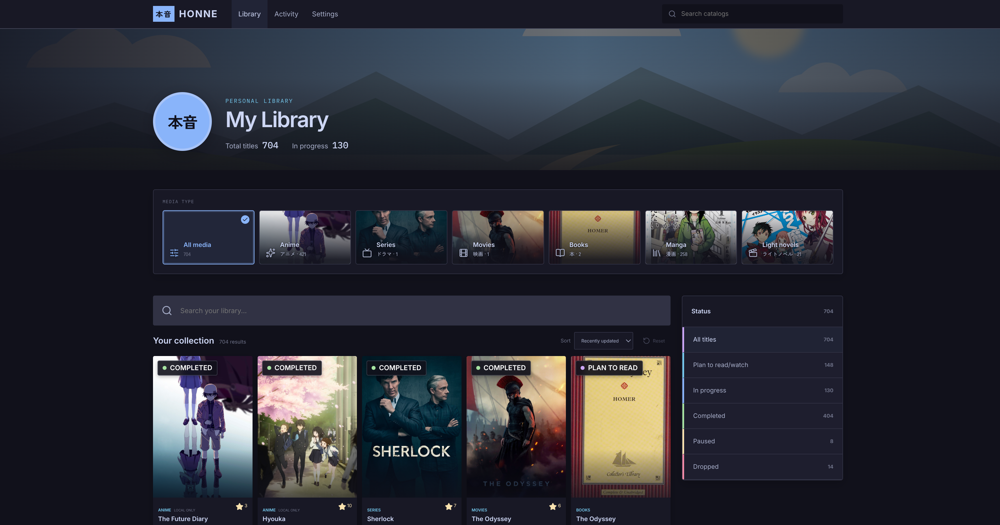
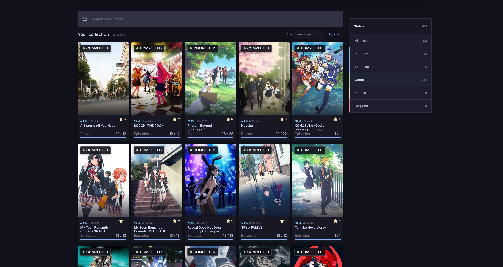

# Honne

A self-hostable, local-first library for anime, series, movies, books, manga, and light novels.

Track what you plan to watch or read, keep personal progress and ratings, enrich titles from optional catalogs, and synchronize AniList-linked entries without giving up ownership of your local collection.




## Highlights

- One Library for anime, series, movies, books, manga, and light novels.
- Type-aware tracking with episodes, pages, chapters, rewatches, and rereads.
- Personal status, progress, rating, notes, and activity history.
- Optional discovery through AniList/Kitsu, TMDB, and Open Library.
- Optional one-way synchronization from Honne to AniList.
- Downloadable JSON backups and a persistent Docker volume.
- No account or external catalog is required for manual tracking.

## Quick start

Docker Compose is the recommended installation method. A release needs only Docker, `compose.yaml`, and `.env`; Git and the source code are not required.

```bash
mkdir -p ~/honne && cd ~/honne
curl -fLO https://github.com/GMkonan/honne/releases/latest/download/compose.yaml
curl -fLO https://github.com/GMkonan/honne/releases/latest/download/env.example
curl -fLO https://github.com/GMkonan/honne/releases/latest/download/checksums.txt
if command -v sha256sum >/dev/null; then sha256sum --check checksums.txt; else shasum -a 256 -c checksums.txt; fi
```

Continue only when both assets report `OK`:

```bash
cp -n env.example .env
chmod 600 .env
# Review .env before starting Honne.
docker compose config --quiet
docker compose pull
docker compose up -d
```

Open [http://localhost:7417](http://localhost:7417). Your collection is stored in the `honne-data` Docker volume and survives container replacement.

Provider credentials are optional. Without them, Honne remains fully usable for manual tracking; AniList/Kitsu and Open Library discovery are credential-free, while TMDB and authenticated AniList synchronization require configuration.

## Documentation

- [Self-hosting, configuration, backup, update, and restore](docs/self-hosting.md)
- [Connect and synchronize an AniList account](docs/anilist-sync.md)
- [Build, develop, validate, and use the API](docs/development.md)

## Build from source

```bash
cp -n .env.example .env
docker compose up -d --build
```

The source Compose environment also opens on [http://localhost:7417](http://localhost:7417) by default. See the [development guide](docs/development.md) for local processes and validation commands.
